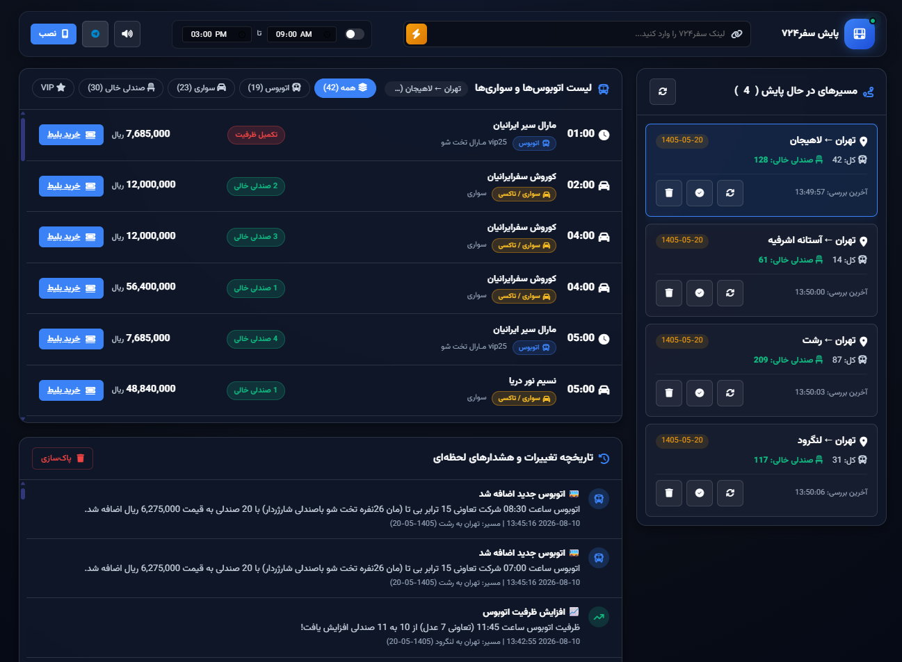

# سامانه پایش هوشمند و هشدار لحظه‌ای سفر۷۲۴

## معرفی

نسخه وب و اپلیکیشن موبایل (PWA)

یک سیستم پیشرفته و هوشمند برای پایش مداوم (هر ۱ دقیقه) صفحات بلیط اتوبوس سفر۷۲۴، تشخیص کوچک‌ترین تغییرات ظرفیت، اضافه شدن اتوبوس جدید، تغییر قیمت، و ارسال نوتیفیکیشن‌های آنی روی موبایل، تلگرام و سیستم.



---

## ویژگی‌های برجسته

| ویژگی | توضیحات |
|---|---|
| پایش خودکار ۱ دقیقه‌ای | بررسی مداوم وضعیت اتوبوس‌ها بدون قطعی و بدون کاهش سرعت سیستم |
| اپلیکیشن موبایل (PWA) | قابل نصب مستقیم روی آیفون (iOS) و اندروید از طریق گزینه «Add to Home Screen» |
| نوتیفیکیشن لحظه‌ای تلگرام | دریافت پیام فوری همراه با لینک مستقیم خرید، به محض باز شدن صندلی جدید |
| هشدار صوتی | پخش صدای هشدار در صورت پیدا شدن بلیط خالی |
| داشبورد مدرن (Glassmorphism) | نمایش اتوبوس‌ها با قابلیت فیلتر بر اساس صندلی خالی، اتوبوس‌های VIP، و تاریخچه رویدادها |
| پارس هوشمند لینک | پشتیبانی از وارد کردن مستقیم لینک سفر۷۲۴ (مانند `https://safar724.com/bus/tehran-lahijan?date=1405-05-20`) |

---

## راهنمای اجرا

### ۱. ساخت و فعال‌سازی محیط مجازی (venv)

در مسیر پروژه دستور زیر را اجرا کنید تا محیط مجازی پایتون ساخته شود:

```bash
python -m venv venv
```

سپس محیط مجازی را فعال کنید:

```bash
# ویندوز
venv\Scripts\activate

# لینوکس / مک
source venv/bin/activate
```

### ۲. نصب پیش‌نیازها

با استفاده از فایل `requirements.txt` تمام کتابخانه‌های مورد نیاز را نصب کنید:

```bash
pip install -r requirements.txt
```

### ۳. اجرای سرویس

```bash
python server.py
```

پس از اجرای سرویس، وب‌سایت در آدرس زیر در دسترس خواهد بود:

**`http://localhost:8000`** (یا آدرس IP شبکه شما برای دسترسی از موبایل)

---

## راهنمای نصب روی گوشی موبایل

### اندروید (Google Chrome)

1. مرورگر کروم گوشی خود را باز کرده و به آدرس سامانه بروید.
2. روی دکمه «نصب اپلیکیشن» بالای صفحه، یا از منوی سه‌نقطه کروم گزینه «Add to Home Screen» را انتخاب کنید.

### آیفون (Safari)

1. در مرورگر Safari آدرس سامانه را باز کنید.
2. دکمه Share (مربع با فلش رو به بالا) را بزنید و گزینه «Add to Home Screen» را انتخاب کنید.

---

## راهنمای اتصال به تلگرام

1. در تلگرام وارد ربات `@BotFather` شوید و یک ربات جدید بسازید تا Bot Token دریافت کنید.
2. وارد ربات `@userinfobot` شوید تا Chat ID عددی خود را دریافت کنید.
3. در بخش تنظیمات تلگرام (آیکون تنظیمات، بالای داشبورد)، Token و Chat ID را وارد کرده و گزینه «ارسال پیام تست» را بزنید.
